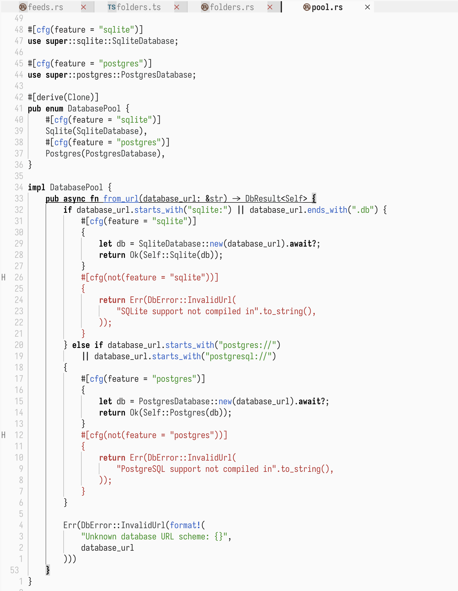

# gruber-void-lite.nvim

A light Neovim colorscheme ported from the [Zed](https://zed.dev/) "Gruber Void Lite" theme.



## Features

- Light theme with a minimal, monochrome aesthetic
- Bold keywords and operators
- Red comments, green strings, blue functions
- Treesitter and LSP semantic token support
- Terminal ANSI colors
- Plugin support: nvim-tree, Telescope, bufferline, nvim-cmp, indent-blankline, gitsigns, todo-comments

## Installation

### [lazy.nvim](https://github.com/folke/lazy.nvim)

```lua
{
  "dzania/gruber-void-lite.nvim",
  priority = 1000,
  config = function()
    vim.cmd("colorscheme gruber-void-lite")
  end,
}
```

## Palette

| Element    | Color     |
|------------|-----------|
| Background | `#FAFAFA` |
| Foreground | `#242323` |
| Comments   | `#aa3731` |
| Strings    | `#448c27` |
| Functions  | `#325cc0` |
| Keywords   | `#000000` |
| Types      | `#383A3B` |
| Operators  | `#292929` |
| Numbers    | `#595959` |
